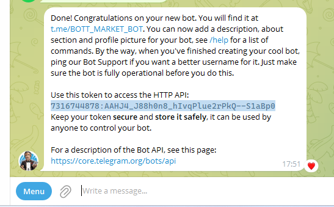
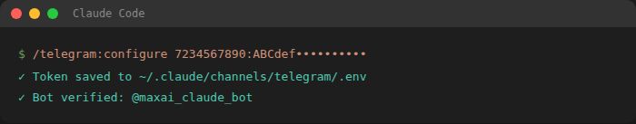

# MAX AI — Telegram Agent

חבר את הסוכן של **Claude** לטלגרם — ותדבר איתו מהטלפון, מכל מקום. בלי לכתוב קוד.

> שלח הודעה בטלגרם → הסוכן שלך מקבל, חושב, ועונה — עם כל הכלים, הקבצים והזיכרון שלו.

פלאגין Claude Code מבית **MAX AI / מקסים גומברג**. מבוסס על מערכת ה-COO האמיתית שרצה אצלנו 24/7, ועל מה שלמדנו בשטח: החלק שמבלבל הוא לא טלגרם — אלא **אימות Claude על השרת**.

---

## שתי דרכים להריץ — בחר לפי הצורך

| | 💻 על המחשב שלך | ☁️ על שרת בענן |
|---|---|---|
| **מתי עובד** | כשהמחשב דולק | תמיד — 24/7 |
| **קושי** | הכי קל | בינוני (צריך SSH) |
| **הכי מתאים** | התנסות, שימוש אישי | בוט עסקי שחי לבד |
| **הדרך** | **Channels** (תוסף מובנה) | Channels או בוט custom |
| **אימות Claude** | רגיל, אוטומטי | דרך הכלי `claude_connect.py` |

**רוב האנשים שמתחילים — מריצים על המחשב עם Channels. זה הכי קל.** מי שרוצה בוט שעובד גם כשהמחשב כבוי — מעלה לענן.

---

## התקנה (Claude Code)

```text
/plugin marketplace add MaxGomb/maxai-telegram-agent
/plugin install telegram_agent_max_ai@max-ai
```

ואז פשוט בקש: **"בוא נחבר את הסוכן לטלגרם"** — או הרץ `/telegram`. הסוכן ילווה אותך צעד-אחר-צעד.

---

## מה בפנים

| רכיב | מה הוא עושה |
|------|-------------|
| **סקיל `telegram-setup`** | מלווה אותך אינטראקטיבית: איפה להריץ → אימות → BotFather → חיבור → בדיקה |
| **פקודה `/telegram`** | נקודת כניסה מהירה |
| **כלי `scripts/claude_connect.py`** | מאמת את Claude על שרת בלי מסך ה-login שנתקע — וגם מתקן את שגיאת ה-401 כשהטוקן פג |
| **`scripts/connect_telegram.sh`** | בדיקת מוכנות: גרסאות, Bun, מצב אימות |
| **מדריך חזותי** | [`docs/מדריך-חיבור-טלגרם.html`](docs/מדריך-חיבור-טלגרם.html) — צעד-אחר-צעד עם צילומי מסך |

---

## הזרימה ב-3 צעדים

**1. צור בוט בטלגרם** — שלח `/newbot` ל-[@BotFather](https://t.me/BotFather), קבל TOKEN.



**2. ודא ש-Claude מאומת**
- על המחשב: פשוט הרץ `claude` — הוא יפתח דפדפן ויסיים.
- על שרת: `python3 scripts/claude_connect.py start` → אשר בדפדפן → `finish '<code>'` → `test` (אמור להחזיר `PONG`).

**3. חבר את טלגרם (Channels)** — בתוך Claude Code:
```text
/plugin install telegram@claude-plugins-official
```
הדבק את ה-TOKEN, וזהו.



שלח הודעה לבוט → הוא עונה. 🎉

---

## ⚠️ כשהבוט מפסיק פתאום (שגיאת 401)

כל כמה חודשים הטוקן של Claude פג, והבוט יחזיר שגיאה שמזכירה **401 / authentication**. זה נורמלי. תיקון בדקה (בשרת):
```bash
python3 scripts/claude_connect.py start      # פתח לינק, אשר, קח קוד
python3 scripts/claude_connect.py finish '<code>'
python3 scripts/claude_connect.py test       # ודא PONG
```
לבדיקת מצב הטוקן בכל רגע: `python3 scripts/claude_connect.py check`.

---

## דרישות
- **Claude Code** + מנוי **Max/Pro** (לא נדרש API key בתשלום).
- לדרך ה-Channels: Claude Code **2.1.80+** ו-**Bun** (`curl -fsSL https://bun.sh/install | bash`).
- חשבון טלגרם.

## רישיון
MIT · © MAX AI / Maxim Gomberg · max@ms-marketing.co.il

> נבנה לתלמידי **"אימפריה של איש אחד"** — ופתוח לכולם. אל תוסיף מורכבות שלא נדרשת: במחשב, Channels זה כל מה שצריך.
