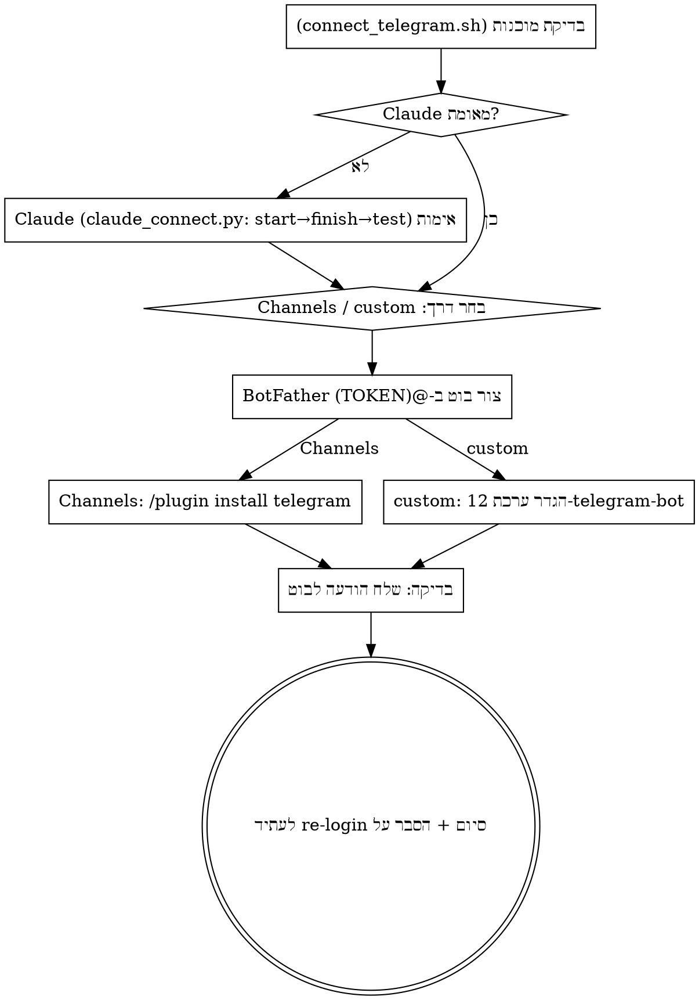

# Set Up Telegram for the Student's Agent

Guide a student through connecting their Claude agent to Telegram — **on their computer or on their own cloud server**.

**This skill mostly does not write code.** It guides decisions and actions, and runs a small helper for the one genuinely tricky part — authenticating Claude on a headless cloud server. At the end the student can message their agent on Telegram and get real answers.

## Interaction Style
Simple Hebrew. Zero jargon. Principle: **"אני עושה, אתה מחליט"** — Claude drives the terminal/SSH, and STOPS for: passwords, browser sign-in (OAuth), and the BotFather steps the student does on their phone. Never type the student's password. Never ask them to paste a password to you.

## איפה ירוץ הסוכן? (החלטה ראשונה — שאל לפני הכל)
**"איפה אתה רוצה שהסוכן ירוץ — על המחשב שלך, או על שרת בענן שעובד 24/7?"**

| | על המחשב (מקומי) | בענן (Contabo וכו') |
|---|---|---|
| מתי עובד | כשהמחשב דולק | תמיד, 24/7 |
| קושי | **הכי קל** | בינוני (צריך SSH) |
| אימות Claude | רגיל — `claude` בטרמינל אמיתי עובד חלק | **דרך `claude_connect.py`** (מסך ה-login נתקע על שרת) |
| מומלץ ל | התנסות / שימוש אישי. **Channels מצוין כאן** | בוט עסקי שחי לבד |

זה קובע את שלב האימות (3): **במחשב — אין את כאב ה-401 של ההתחברות; בענן — יש, ולזה הכלי.**

## The two paths (decide first)
Tell the student plainly there are two ways, and recommend the first:

1. **Channels (מומלצת — קלה, בלי קוד)** — תוסף מובנה של Claude Code. שולחים הודעה בטלגרם ו-Claude Code עצמו עונה, עם כל הכלים והזיכרון. דרישות: Claude Code 2.1.80+ ו-Bun.
2. **בוט Python משלך (למתקדמים)** — ערכת `12-telegram-bot`. שליטה מלאה, אבל יותר שלבים. בחר בזה רק אם התלמיד רוצה לבנות בוט מותאם.

Say: **"יש שתי דרכים. ההמלצה שלי — Channels: זה תוסף מוכן, בלי לכתוב קוד, 10 דקות. נלך על זה?"**

## ⚠️ הנקודה שנתקעים בה (בעיקר בענן)
Claude חייב להיות מאומת. **על המחשב** זה פשוט — `claude` בטרמינל אמיתי פותח דפדפן ומסיים לבד. **על שרת בענן** זה החלק שמבלבל:
- מסך ההתחברות `claude auth login` דורש מסך אמיתי ולא עובד טוב על שרת מרוחק (headless).
- הטוקן פג **כל כמה חודשים** → פתאום הבוט מחזיר שגיאת **401** ("Invalid authentication credentials").

לכן **בענן מאמתים עם הכלי `claude_connect.py`** (לא עם מסך ה-login), ומלמדים את התלמיד להתחבר-מחדש כשזה פג. במחשב — התחברות רגילה מספיקה.

## Flow


## Step-by-Step

### 1. הסבר את היעד
**"בסוף השלב הזה תוכל לשלוח הודעה בטלגרם ולקבל תשובה מהסוכן שלך — מהטלפון, מכל מקום. נעשה את זה בשתי דקות בדיקה, ואז חיבור."**

### 2. בדיקת מוכנות
במחשב — פתח טרמינל; בענן — התחבר ב-SSH לשרת. ואז הרץ מתוך תיקיית הפלאגין:
```bash
bash scripts/connect_telegram.sh
```
זה בודק: Claude מותקן? גרסה תומכת Channels? Bun? **והכי חשוב — האם Claude מאומת.**

### 3. אימות Claude
**מסלול מחשב (מקומי):** פשוט הרץ `claude` בטרמינל. אם לא מחובר, הוא יפתח דפדפן ויסיים לבד. זהו.

**מסלול ענן (שרת headless):** אל תשתמש ב-`claude auth login` — הוא נתקע. במקום:
```bash
python3 scripts/claude_connect.py start
```
- יודפס **לינק**. אמור לתלמיד: **"פתח את הלינק הזה בדפדפן, התחבר עם המנוי שלך (Max/Pro), ואשר. תקבל קוד — תעתיק לי אותו."** — **STOP, חכה לקוד.** (אל תכניס סיסמה בשבילו.)
- כשהתלמיד נותן קוד:
```bash
python3 scripts/claude_connect.py finish '<הקוד>'
python3 scripts/claude_connect.py test
```
- `test` חייב להחזיר **PONG**. אם 401 — הקוד פג, חזור על start.

### 4. צור בוט בטלגרם
**"עכשiו ניצור את הבוט עצמו. פתח טלגרם, חפש @BotFather, שלח /newbot, תן שם, ושם-משתמש שמסתיים ב-bot. תקבל TOKEN — תשמור אותו."** — STOP, זה אצלו בטלפון.

### 5א. דרך Channels (מומלצת)
בתוך `claude` על השרת:
```
/plugin install telegram@claude-plugins-official
```
(אם לא נמצא: `/plugin marketplace add anthropics/claude-plugins-official`)
עקוב אחרי ההגדרה — מדביקים את ה-TOKEN מ-BotFather. דורש Bun מותקן.

### 5ב. דרך custom (למתקדמים בלבד)
הפנה את התלמיד לערכת `12-telegram-bot`: העתק `.env.example`→`.env`, הכנס TOKEN ו-CHAT_ID, הרץ את הבוט, ופרוס כ-systemd. (ה-CHAT_ID מ-@userinfobot.)

### 6. בדיקה אמיתית
**"שלח עכשיו הודעה לבוט שלך בטלגרם — הוא אמור לענות."** אם עונה — סיימנו 🎉

### 7. הסבר חשוב לעתיד (re-login)
אמור תמיד בסוף:
**"דבר אחרון חשוב: כל כמה חודשים הטוקן של Claude פג, ואז הבוט יחזיר שגיאה. זה נורמלי ולוקח דקה לתקן — פשוט תריץ שוב:"**
```bash
python3 scripts/claude_connect.py start    # פתח לינק, אשר, קח קוד
python3 scripts/claude_connect.py finish '<הקוד>'
python3 scripts/claude_connect.py test
```

## כללי ברזל
- לעולם לא להקליד סיסמה של התלמיד, ולא לבקש סיסמה בצ'אט.
- ה-TOKEN של הבוט וה-credentials נשמרים רק על השרת. לא מדפיסים אותם בצ'אט.
- אם `test` נכשל ב-401 — זו תפוגת טוקן, לא באג. start→finish שוב.
- אל תוסיף מורכבות שלא נדרשת. Channels זה ברירת המחדל.
